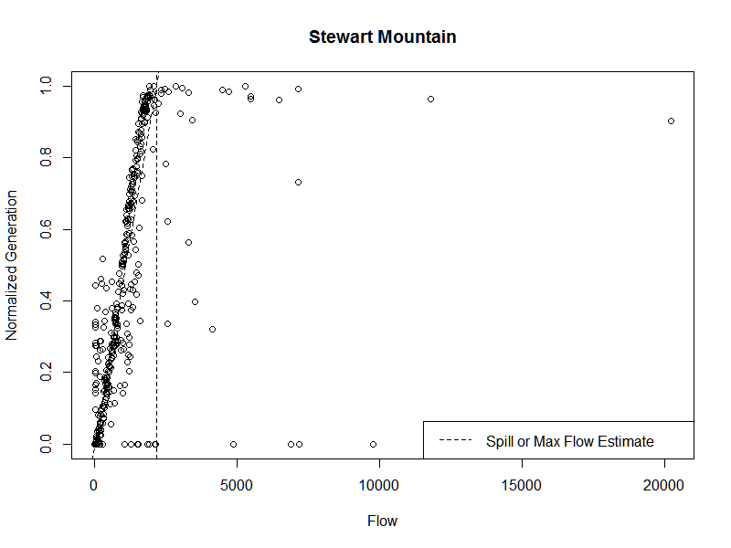

## Abstract
A model to relate flow to hydroelectric generation is developed from an empirical standpoint, rather than the usual operational perspective. The model though simplistic, forms the basis for integration into a larger framework relating climate to hydroelectric generation by way of flow. The more general framework could be considered the previously submitted Bayesian latent flow model, with reparameterization based on parameters from these results. Or the results could serve as an intermediary between generation and an ECM model of flow/climate.

## Introduction
Hydroelectric power represents a significant fraction of US power at 7% and a majority fraction of the nation's renewable power at about 55%. In light of a carbon constrained future, it becomes an important starting point to examine any potential effects of climate change on the hydroelectric power supply. In particular, what will changing temperatures and precipitation patterns mean for hydroelectric power? Determining the size of climate effect on generation (if any) is of interest to planners and policy makers both in terms of carbon pricing and in terms of normative responses.

After an initial exploration of the data in a latent streamflow model with somewhat unsatisfactory results, data on actual streamflow was acquired. This has allowed the validation of some of the initial assumptions regarding the relationship between flow and generation. In particular the finding that the minimum flow to generate parameter is probably zero for most dams. Given that there is no minimum flow to generate, the maximimum flow beyond which the damn can no longer generate more power, is estimateable solely from the slope.




This relationship is illustrated above for the Stewart Mountain Dam. From the image it is clear that the intercept is zero. Given the intercept of zero, and a unit cap (for the normalized monthly generation), max flow may be determined solely from the slope of the relationship. Importantly this means that the max flow parameter may be estimated even for dams for which there are no flow observations over flow max.

### Read in the Data
Reading in the data.
```{r, echo=FALSE}
machine <- "mm"
sim <- 3
source(file=paste("C:/Users/",machine,"/Dropbox/code/r/load_files.R",sep=""))
fileNames <- load_file_names(machine, sim)
setwd(fileNames[["ge509_project"]])
source(file=fileNames[["panel_lags_src"]])
source(file=fileNames[["mc_predict_src"]])
source(file=fileNames[["panel_functions_src"]])
source(file=fileNames[["mc_predict_src"]])

############################################################
######### Read in the data #################################
############################################################

df_unit_info  <- load_file(file="unit", machine, sim)
df_gldas_eia  <- load_file(file="data", machine, sim)

# Trim/Generate variables
df_data    <- df_gldas_eia[c("time","year","month","plant_code","HUC2","generation","totrun","avsft")]
# Add back corrupted FE vars from FE data.frame df_unit_info
df_data    <- merge(df_data, df_unit_info[,c("plant_code","drain", "capacity","plant.dam.name")], all.x=T)
names(df_data)[names(df_data)=="plant.dam.name"] <- "plant name"


salt_river <- c(149, 145, 148, 150)  # Salt River dams
lower_snake <- c(6175, 3926, 3927,3925) # upstream to downstream

data_prepper <- function(df, plant_codes, run_name, blast90s=T){  
  # Make data conformal, fill in missing with NA
  library(plyr)  
  data <- list()
  
  data$run_name <- run_name
  # Determine range of years
  years <- sort(unique(df[df$plant_code%in%plant_codes,"year"])) # years <- 1970:2010  
  
  data$year <- years
  
  template <- expand.grid(month = 1:12, year=years, plant_code = plant_codes)
  df_na <- join(template, df, by=c("plant_code", "year", "month"))
  
  # Blast 1996-1999 for bad measurements
  if(blast90s){
    df_na$generation[df_na$year %in% 1996:1999] <- NA
    df_na$lgen[df_na$year %in% 1996:1999]       <- NA  
  }
  
    
  # df_NA MUST be ordered by plant_code, year, then month.
  # should still be sorted after the join.
  
  # rescale data 0 to 1 using generating capacity and length of month
  data$norm_gen <- matrix(data=df_na$generation/max_gen(df_na$month, df_na$capacity), nrow=12*length(years), ncol=length(plant_codes))
  
  # Ceiling: clip out presumably eroneous observations. On this end they are 1:1000 obs
  data$norm_gen <- pmin(data$norm_gen,1,na.rm = F)
  
  # Floor: clip out eroneous observations and some residual pumped storage.
  data$norm_gen <- pmax(data$norm_gen,0,na.rm = F)
  
  # data$X
  # covars, currently univariate pulled from most upstream dam
  data$totrun <- df_na[df_na$plant_code==plant_codes[1],"totrun"]
  data$avsft  <- df_na[df_na$plant_code==plant_codes[1],"avsft"]
  
  # capacity info (for FE)
  data$capacity <- unique(df_na[,c("capacity","plant_code")])$capacity
  
  # plant order (for FE)
  data$plants <- plant_codes
  
  # For convenience
  data$plant_names <- as.character(unique(df_na[,c("plant name","plant_code")])[,"plant name"])
  
  data$nt <- 12*length(years)
  data$month <- rep(1:12,data$nt)
  data$np <- length(plant_codes)
  data$N  <- data$np*data$nt
  
  return(data)
}

bind_flow <- function(data, flow){
  # Make flow conformal to span dataset
  template <- expand.grid(month = 1:12, year=data$year)
  flow        <- flow[,c("year_nu","month_nu","mean_va")]
  names(flow) <- c("year","month","flow")
  data$z <- join(template, flow, by=c("year","month"))$flow
  return(data)
}

sr   <- data_prepper(df_data, plant_codes = salt_river, run_name = "Salt River", blast90s = F)
ls   <-  data_prepper(df_data, plant_codes = lower_snake, run_name = "Lower Snake", blast90s = F)
setwd("C:/Users/mm/Dropbox/Coursework/study_projects/dam_modeling/streamflow")

# 09498500 Roosevelt Dam
# 09502000 below stewart mountain
# 13343600 below lower granite
# rd <- read.delim(file = "09498500.txt")
stewart_mountain <- read.delim(file = "09502000.txt")
lower_granite <- read.delim(file = "13343600.txt") 

ls <- bind_flow(ls, lower_granite)
sr <- bind_flow(sr, stewart_mountain)

sub <- subset(df_data, plant_code==sr$plants[4])
sub$pct_gen <- sub$generation/sub$capacity/720

plot_dam <- function(data,fits, p){
  # Plot results of mle fit for parameters
  if(length(fits[[p]]$par) ==3){
    z.min <- fits[[p]]$par[1]
    z.max <- fits[[p]]$par[2]
    mu_x  <- pmin(pmax(data$z-z.min,0),z.max-z.min)/abs(z.max-z.min)
  }
  if(length(fits[[p]]$par) ==2){
    z.max <- fits[[p]]$par[1]
    mu_x   <- pmin(data$z,z.max)/z.max
  }  
  ts.plot(ts(data$z/z.max),ts(mu_x),col=1:2, main=data$plant_names[p])
    legend("topright",legend=c("Scaled Flow", "Predicted Gen"),col=1:2, lty=c(1,1))
  ts.plot(ts(data$norm_gen[,p]),ts(mu_x),col=1:2, main=data$plant_names[p])
  legend("topright",legend=c("Actual", "Predicted"),col=1:2, lty=c(1,1))
  cor(mu_x, data$norm_gen[,p], "complete.obs")
}

plot_gen_v_flow <- function(data, fits, p){
  if(length(p)==1){
      plot(data$z, data$norm_gen[,p], ylim=c(0,1),xlab="Flow",ylab="Normalized Generation", main=data$plant_names[p])
      } else {
        plot(rep(data$z,length(p)), data$norm_gen[,p], ylim=c(0,1),xlab="Flow",ylab="Normalized Generation", main=data$run_name, col=p)
        legend("bottomright",legend=data$plant_names, lty=rep(1,length(p)), col = p)
      }
  if(!is.na(fits)){
      if(length(fits[[p]]$par)==3){
         z.max <- sapply(fits, function(x){x$par[2]})
         z.min <- sapply(fits, function(x){x$par[1]})
         abline(b = 1/z.max[p], a=-z.min[p]/z.max[p], lty=2)
         
      } 
      if (length(fits[[p]]$par)==2){
         z.max <- sapply(fits, function(x){x$par[1]})
         abline(b = 1/z.max[p], a=0, lty=2)
      }
    abline(v=z.max[p], lty=2)
    abline(h = 1)
    legend("bottomright",legend=c("Spill or Max Flow Estimate"), lty=c(2))
  }
} 
```

## Data and Methods

The EIA has a relatively long data set on the vast majority of the installed capacity in the US (80 gigawatts). The EIA-759 and 906/920 datasets provide a monthly data set from 1970 to 2012 broken only by a 5 year period of errant reporting from 1996 to 1999 during which organizational changes at the EIA resulted in annual sampling at some installations rather than monthly; a subset which they do not provide identifying information for. That, combined with climate variable estimates from the GLDAS NOAH model (historical backfit), allows for the estimation of relationships between generation and climate. The USGS has streamflow data for various periods, scales, and locations.

|     Source |   Variables |  Spatial Scale | Frequency|
|---------:|------------:|--------:|------------:|
| EIA 759, 906/920  |   Generation, Capacity| Point Referenced|    Monthly|
| NOAH  |   Runoff, Temperature | Block Referenced|    Monthly|
| USGS  | Streamflow| Point Referenced |    Monthly (Daily)|
| Manual| Streamflow| Directed Graph |    NA |


There are multiple alignment issues with the data. They have been ignored due to time and processing constraints (estimated at maybe a week).

The block referenced data is overlayed to the point data. The point data is sometimes linked with the directed graph indicating the direction of streamflow and order of dams.


### About the Data and the models

For my case example four dams on the Salt River (ENE of Phoenix) are analyzed. They span 30 or so miles along the Salt River just below the Theodore Roosevelt Lake impoundment at the Roosevelt dam (not to be confused with the Franklin Roosevelt Lake in Washington).

The generation has been scaled between the theoretical maximum of generation over the length of the month, and zero.

Based on plots (not shown) of scaled generation, it can be seen that with only a handful of exceptions, the data is clearly bound between zero and one. More importantly the data *should* be bound between zero and one because the dams in the sample have no significant pumped storage (the lower bound should be zero) and the installed capacity has never changed (the upper bound should be one). Here I shall be clipping the estimates between zero and one. How exactly to bound the data without biasing the results is a question I hope to address, but there is a physical basis for doing so.

For another physical constraint, based on the literature many dams share flow with little to no ability to store water intertemporally. It is at this point in the original analysis that the decision was made to construct flow as a latent variable in a hierarchical model.

Flow: $z = f(\text{price}, \text{temperature}, \text{runoff})$ with $z > 0$.

The physical constraints on the amount of flow that can be converted into generation, the "flow parameters," will vary by dam:

Generation $Y_i = f_i(Z)$, where $f_i$ is non-linear in $Z$. That is $Y_i=1$ for $Z > Zmax_i$. $Y_i=0$ for $Z\leq Zmin_i$, with the slope of $\frac{1}{Zmax_i-Zmin_i}$ between.

```{r}
# Example
par(mfrow=c(1,2), oma=c(0,0,2,0))
Z     <- (1:1000)/10
Z_min <- runif(4, min = 0, max = 10)
Z_max <- runif(4, min = 30, max = 50)
Y     <- matrix(data = 0, nrow=4, ncol=1000)
for(i in 1:4){
  for(j in 1:1000){
    if(Z[j] < Z_min[i]){
      Y[i, j] <- 0
    } else{
      if(Z[j] < Z_max[i]){
        Y[i, j] <- (Z[j] - Z_min[i])*1/(Z_max[i]-Z_min[i])
      } else {
        Y[i, j] <- 1
      }
    }    
  }
}
plot(Z, Y[1,], type="l", xlab="Flow", ylab="Normalized Generation", main="Pseudodata")
lines(Z, Y[2,], col=2)
lines(Z, Y[3,], col=3)
lines(Z, Y[4,], col=4)
legend("bottomright", legend=paste("Sample Dam",1:4), col=1:4, lty=c(1,1,1,1))

plot_gen_v_flow(sr,fits=NA,p=1:4)

```

```{r,echo=F}
par(mfrow=c(1,1), oma=c(0,0,0,0))
```

With the type of model demonstrated above, this allows dams to exhibit strong correlation in certain flow ranges, but for the relationship to decouple after the dams have exceeded or underflowed its flow-to-generation capacity.

### A Change of Tack, Flow Parameter MLE

During the prelimnary results, this hierarchical latent flow model is estimated in the Bayesian context using an MCMC. While the model did converge, the uncertainty on flow and flow parameters rendered the results essentially useless. With the availability of streamflow information (for select dams) a latent model is painfully superfluous in estimating flow parameters. More to the point, the streamflow information may be used directly to estimate the flow parameters.


```{r}
# Single unit ll z.max fit
f_gen <- function(z.min, z.max, data){
  pmin(pmax(data$z-z.min,0),z.max-z.min)/abs(z.max-z.min)
}

ll_z <- function(pars,unit, data){
  z.min  <- pars[1]
  z.max  <- pars[2]
  se.max <- pars[3]
  # mu_x   <- pmin(data$z,z.max)/z.max
   mu_x   <- f_gen(z.min, z.max, data)
  -sum(dnorm(x = data$norm_gen[,unit], mean=mu_x, sd=se.max, log=T),na.rm=T)
}
run_z_fits <- function(data, lower, upper){
  fits <- list()
  for(p in 1:data$np){
    # zmin is started high and zmax is started low to guarantee convergence
    fits[[p]] <- optim(par = c(obs_max_z/50, obs_max_z/10,0.1),
                     lower = lower, upper = upper,
                     unit=p, method="L-BFGS-B", ll_z, data=data)
  }
  return(fits)
}
obs_max_z <- max(sr$z,na.rm=T)

# Free parameters
fits   <- run_z_fits(data = sr,
                     lower=c(0.001, 0.01,0.001),
                     upper=c(obs_max_z/10, obs_max_z,1))
# Force z.min to be zero 
fits0  <- run_z_fits(data = sr,
                     lower=c(0.001, 0.01,0.001),
                     upper=c(0.01, obs_max_z,1))
```

## Results

The model is run twice, the second time restricting the minimum flow parameter to be zero. An AIC test is then performed which appears to determine quite conclusively that z.min is indistinguishable from zero.

```{r}

free_ln_likelihood <- sapply(fits,  function(x){x$value})
zero_ln_likelihood <- sapply(fits0, function(x){x$value})
z.min_free         <- sapply(fits,  function(x){x$par[1]})
z.min_zero         <- sapply(fits0, function(x){x$par[1]})
results <- data.frame(Dam = rep(sr$plant_names,2),Model=c(rep("Free",4), rep("Z.min zero",4)), ln_likelihood=c(free_ln_likelihood, zero_ln_likelihood), AIC = c(2*(3+free_ln_likelihood),2*(2+zero_ln_likelihood)), z.min =round(c(z.min_free, z.min_zero),3))
results[with(results, order(Dam, Model)),]
```

Provided this conclusion holds true for the broader set of dams, the consequence is to make estimation of z.max tractable even without any flow observations exceeding z.max.

```{r,echo=FALSE}
data <- sr
TSS <- sum((unlist(data$norm_gen)-mean(data$norm_gen, na.rm=T))^2, na.rm=T)
RSS <- 0
for(i in 1:4){
  RSS <- RSS + sum((data$norm_gen[,i]-f_gen(fits0[[i]]$par[1],fits0[[i]]$par[2], data))^2, na.rm=T)
}
R2 <- 1- RSS/TSS 

```

The hierarchical flow model itself has an R2 of `r R2`.

## Discussion

Of crucial interest is tieing flow to climate parameters. Particularly generating flow rules based on long-run relationships between flow and total runoff (which are essentially storage volume). To that end, consider the following plots.

```{r}
# Flow relation to totrun

ma <- function(x,n,self=0){filter(x,c(self,rep(1/n,n)),sides=1)}
par(mfrow=c(1,2), oma=c(0,0,2,0))
# runoff -> flow, contemporeneous
plot(data$totrun, data$z,xlab = "Runoff", ylab="Flow",xlim=c(0,18),ylim=c(0,3200))
# Idea: error correction model in this space
# runoff -> flow, smoothed
n <- 24
plot(ma(data$totrun, n), ma(data$z,n), col=data$month, xlab = "Smoothed Runoff", ylab="Smoothed Flow")
title("Flow v. Runoff", outer=T)
lines(ma(data$totrun, n)[(n+1):data$nt], ma(data$z,n)[(n+1):data$nt])
par(mfrow=c(1,1), oma=c(0,0,0,0))
```

Here there is no obvious relationship between flow and runoff in the contemporaneous plot, and a clear relationship in the `r n`-month smoothed plot.

I believe the meaning is one of a conservation rule. Outflows (flow) less losses (evapotransport, withdrawls) is equal to inflows (runoff). Since losses are unaccounted in my model, they will show up as a decrease in the intercept. The apparently positive artifact in the smoothed runoff plot above is likely an artifact of both snowpack and/or grid alignment. Recall that runoff is only coarsely taken from nearest point, rather than some aggregate over a drainage area.

The conservation rule immediately suggests an error correction model, with present flow being determined by both short-run factors and by the disequilibrium from long-run flow-runoff balance. An ECM is the next rational step in the analysis, which unfortunately I did not have time to do.

Another distinct possibility is insertion into the Bayesian framework from the preliminary work, where some dams could have known (strong prior) z.max parameters, some dams could have known flow, and flow could be backed out at other networked locations. However this is only really considered an improvement over the ECM when dealing with intermediary flow gains/losses between network locations. Since otherwise the added information is superfluous. And since modeling the gains and losses is considerably more error prone than the simpler approach, it seems prudent to try the ECM first. 

### Temperature relations

```{r}
par(mfrow=c(1,2), oma=c(0,0,2,0))
plot(ma(data$avsft, 3), ma(data$z,3), col=data$month, main="Three Month Smoothed", xlab="Temperature", ylab="Flow")
plot(ma(data$avsft, 24), ma(data$z,3), col=data$month, main="24 Month Smoothed", xlab="Temperature", ylab="Flow")
par(mfrow=c(1,1), oma=c(0,0,0,0))

```

The graphs present the relationship between flow and temperature broken out by month(color) and smoothing scale. Flow increases in the hotter periods, but only on short time scales, which is indistinguishable from seasonal demand. Therefore I do not believe that temperature will contribute to the long-run relationship in an ECM.


## Acknowledgements

In particular I would like to thank Prof. Dietze for his help in selecting various models and pointing out pitfalls, as well as Pat Sorensen for his feedback on the process.

## References

All data referenced in the text is identified by series and source explicitly.

