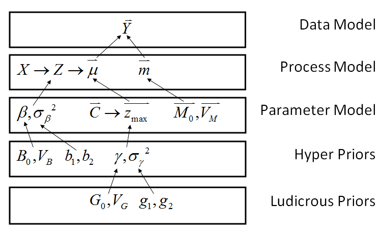

### Introduction
I have sought out to obtain high-frequency generation and price data for a subset of the dams. It looks like short of a FOIA request I'm going to be hard pressed to find this information on anything but the shortest of time periods (hourly for 1 week, Army Corps of Engineers).

### Model
During the course I have been reviewing the form of my current model. At present I'm using a hidden Markov model of the form: $(y=f(Xb) | z)$, $(z_{t+1} = f(Xb)|z_t)$ with the state transition model being a multinomial logit. And the response model being gaussian. Not only do I believe I need to incorporate some of the physical constraints of the system, but also I'm beginning to believe that there may be better approaches.

```{r, echo=FALSE}
# Data exploration

machine <- "mm"
sim <- 3
source(file=paste("C:/Users/",machine,"/Dropbox/code/r/load_files.R",sep=""))
fileNames <- load_file_names(machine, sim)

source(file=fileNames[["panel_lags_src"]])
source(file=fileNames[["mc_predict_src"]])
source(file=fileNames[["panel_functions_src"]])
source(file=fileNames[["mc_predict_src"]])


############################################################
######### Read in the data #################################
############################################################

df_unit_info  <- load_file(file="unit", machine, sim)
df_gldas_eia  <- load_file(file="data", machine, sim)

# Trim/Generate variables
df_data    <- df_gldas_eia[c("time","year","month","plant_code","HUC2","generation","totrun","avsft","lgen","drain", "capacity","plant_name")]

plants <- unique(df_data$plant_code)

#df_unit_info[df_unit_info$plant_code %in% 145:150,]
```

```{r}
# rescale data using capacity and length of month
plant = 149 # Roosevelt Dam on the Salt River, East of Phoenix
sub <- subset(df_data, plant_code==plant)
sub$pct_gen <- sub$generation/max_gen(month = sub$month , capacity = df_unit_info$capacity[df_unit_info$plant_code==plant])
par(mfrow=c(1,2))
hist(sub$pct_gen, main=NA, xlab="Percent of Maximum Generation")
ts.plot(sub$pct_gen, ylab="Percent of Maximum Generation", xlab="Month")
title("Generation at Roosevelt Dam",outer=T)
```

Observe the two plots of scaled generation at Roosevelt Dam. It can be seen that with only a handful of exceptions, the data is clearly bound between zero and one. More importantly the data *should* be bound between zero and one because Roosevelt has no pumped storage (the lower bound should be zero) and the installed capacity has never changed (the upper bound should be one). How exactly to bound the data without biasing the results is another story (see below, pseudo data demonstrates bias of parameter estimates when clipping $Y$ values).

For another physical component, based on the literature many dams share flow with no ability to store water intertemporally. Therefore it may be easier to construct an intermediate variable, flow, and use flow to inform production on a handful of dams. This is a type of hierachical model we went over in lecture 18. I believe this is equivalent to a continuous latent state model (but not Markov).

Flow $z = f(\text{price}, \text{temperature}, \text{runoff})$ with $z > 0$.

Generation $y_i = f_i(z)$, where $f_i$ is non-linear in $z$. That is $y=1$ for $z > z_{max}$. $y=0$ for $z\leq z_{min}$.

I believe the data model can be specified as a binomial function that takes as its mean, $p$, rather than $np$. Or the binomial divided through by $n$ in the domain. This may be thought of as the fraction of the number of days/hours/intervals that the dam is "on" (depending on the choice of $n$ and the time interval, $t$, of the sample data). While the data is continuous and the binomial is not, I believe that for a sufficient value of $n$, the binomial will closely approximate the data.

```{r, echo=FALSE}
library("boot")
```
```{r}
n = 100
xseq <- seq(-10,10,length.out=n)

# y follows a continuous logit + gaussian error
y <- inv.logit(xseq) + rnorm(n, mean=0, sd=0.1)  
plot(xseq,y)

# clip y to the support of the logit
y[y<=0] <- 0.0000000001  
y[y>=1] <- 0.9999999999
fit <- glm(y~xseq, family = gaussian("logit"))
preds <- predict(fit, type="link", se.fit=T)
lines(xseq,inv.logit(preds$fit), col=3)
lines(xseq,inv.logit(preds$fit+1.96*preds$se.fit), col=3,lty=2)
lines(xseq,inv.logit(preds$fit-1.96*preds$se.fit), col=3,lty=2)
mu = inv.logit(xseq)
lines(xseq,mu)
legend("topleft",legend=c("95% CI", "True"),col=c(3,1),lty=c(2,1))
title("Clipped Y regressed on X")


```
### $X$
Covariates include price, runoff, temperature, and perhaps cumulative runoff figures for some number of lags.

### $C$ & $Z_{max}$
Nameplate capacity is expected to determine $Z_{max}$ in a roughly linear fashion with some error. That is to say, the maximum flow that the facility can take advantage of, is directly in proportion to the installed capacity. $Z_{max}$ cannot be negative.

### Error in the variables
Flow is not at all observed, I would expect great errror in estimating it. And with the aforementioned exception of negative values of generation or >100% values in generation, there is probably very little error in $Y$. $Y$ is a measured value of great interest to markets and the sale of generation is carefully recorded to bill consumers. However, based on the data source, monthly reports filed to the EIA, it is likely that *that* number is probably less accurate.

Errors in flow are included in a distribution about the predicted value $X\beta$.

### Model Graph



